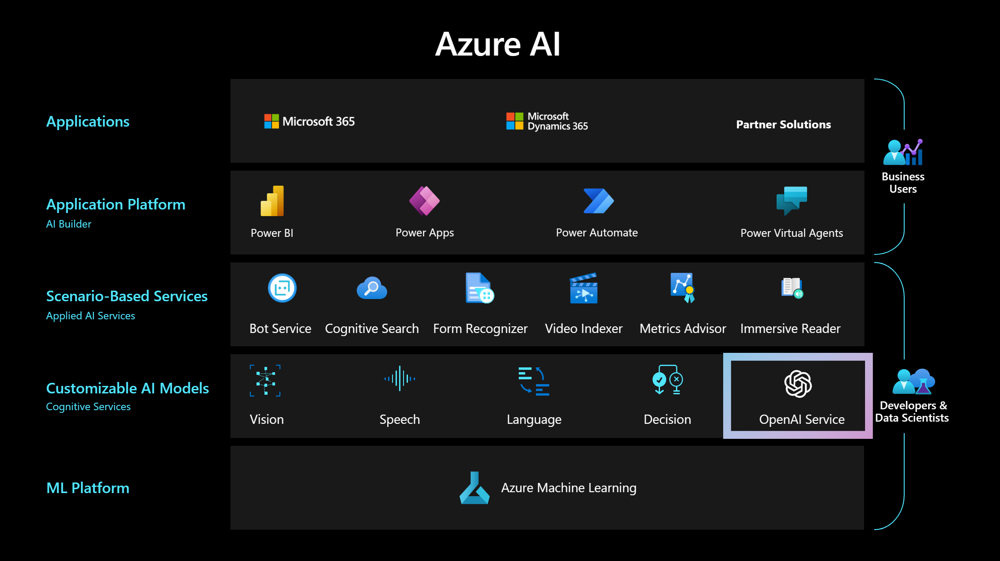

# Microsoft US Education Azure OpenAI Workshop

[Azure OpenAI Service](https://learn.microsoft.com/en-us/azure/cognitive-services/openai/overview) provides REST API access to OpenAI's powerful language models including the GPT-3, Codex and Embeddings model series. These models can be easily adapted to your specific task including but not limited to content generation, summarization, semantic search, and natural language to code translation. Users can access the service through REST APIs, Python SDK, or our web-based interface in the Azure OpenAI Studio.

In this workshop, you will learn how to use the Azure OpenAI service to create AI powered solutions. You will get hands-on experience with the latest AI technologies and will learn how to use Azure OpenAI API. 

## Lab Prerequisites and Deployment

The following prerequisites must be completed before you start these labs

- WI-FI enabled Laptop
- You must be connected to the internet
- Use either Edge or Chrome when executing the labs.
- Access to an Azure Subscription with [Contributor Access](https://learn.microsoft.com/en-us/azure/role-based-access-control/role-assignments-steps)
  > **IMPORTANT**: Only use your institutions/organization email. Do not use a personal email address (Example: @gmail.com, @yahoo.com, @hotmail.com, etc.)
- Approved access to Azure OpenAI service to this subscription, you can request access [here](https://customervoice.microsoft.com/Pages/ResponsePage.aspx?id=v4j5cvGGr0GRqy180BHbR7en2Ais5pxKtso_Pz4b1_xUOFA5Qk1UWDRBMjg0WFhPMkIzTzhKQ1dWNyQlQCN0PWcu)

  > **IMPORTANT**: Authorization can take up to 10 business days

- [Azure Open AI](https://learn.microsoft.com/en-us/azure/cognitive-services/openai/how-to/create-resource?pivots=web-portal) already provisioned and **text-davinci-003** model is deployed. The model deployment name is required in the Azure Deployment step below. **South Central US** is recommended region for deploying Azure Open AI.

- Required Resource Providers [How to Register Azure Services](https://learn.microsoft.com/en-us/azure/azure-resource-manager/management/resource-providers-and-types)
  
  - Azure OpenAI
  - Microsoft.Search
  - Microssoft.Functions
  - Microsoft.Authorization
  - Microsoft.CognitiveServices
  - Microsoft.ManagedIdentity
  - Microsoft.KeyVault
  - Microsoft.Storage  
  - Microsoft.Insights
  - Microsoft.EventHub
  - Microsoft.Application
  - Microsoft.LogiApps

- [VS Code](https://code.visualstudio.com/download) installed in your Computer
- [Power platform](https://powerplatform.microsoft.com/en-us/?&ef_id=_k_EAIaIQobChMIxp3J2OCf_wIVjqXICh3SlgyJEAAYASABEgI4c_D_BwE_k_&OCID=AIDcmm90q7bk03_SEM__k_EAIaIQobChMIxp3J2OCf_wIVjqXICh3SlgyJEAAYASABEgI4c_D_BwE_k_&gad=1&gclid=EAIaIQobChMIxp3J2OCf_wIVjqXICh3SlgyJEAAYASABEgI4c_D_BwE)- 30 days trial (if no licensing)
- [Postman](https://www.postman.com/downloads/)
- Azure Cloud Shell is recommended as it comes with preinstalled dependencies.
- [Conda](https://conda.io/projects/conda/en/latest/user-guide/install/windows.html) is recommended if local laptops are used as pip install might interfere with existing python deployment.

## Agenda

**TODO: Review the timelines

| Activity | Duration |
| --- | --- |
| Opening Remarks | 30 minutes |
| What is Azure OpenAI | 30 minutes |
| Large Language Models & Prompt Engineering | 30 minutes|
| [Lab 1: Low Code/No Code ChatGPT] | 45 minutes |
| Lab 2: Chat with your documents | 45 minutes |
| Lunch | 60 minutes |
| Lab 3: Chat with your databases | 45 minutes |
| Lab 4: Batch processing with Synapse? | 75 minutes |
| Build Updates | 30 minutes |

## Before you begin

  [Retrieve your Azure OpenAI end point and keys](https://learn.microsoft.com/en-us/azure/cognitive-services/openai/quickstart?tabs=command-line&pivots=programming-language-python#retrieve-key-and-endpoint) and copy them to notepad for future reference as you will be using them throuhout this labs

## Format

- All use cases have examples and instructions in a github repo
- Instructor will run through an overview of solutions and steps
- Audience will follow and build the solution in their environment

## Audience

- Power Users
- Software Engineers
- Data Scientist
- AI architects and Managers

## Contributing

This project welcomes contributions and suggestions.  Most contributions require you to agree to a
Contributor License Agreement (CLA) declaring that you have the right to, and actually do, grant us
the rights to use your contribution. For details, visit https://cla.opensource.microsoft.com.

When you submit a pull request, a CLA bot will automatically determine whether you need to provide
a CLA and decorate the PR appropriately (e.g., status check, comment). Simply follow the instructions
provided by the bot. You will only need to do this once across all repos using our CLA.

This project has adopted the [Microsoft Open Source Code of Conduct](https://opensource.microsoft.com/codeofconduct/).
For more information see the [Code of Conduct FAQ](https://opensource.microsoft.com/codeofconduct/faq/) or
contact [opencode@microsoft.com](mailto:opencode@microsoft.com) with any additional questions or comments.

## Trademarks 

This project may contain trademarks or logos for projects, products, or services. Authorized use of Microsoft 
trademarks or logos is subject to and must follow 
[Microsoft's Trademark & Brand Guidelines](https://www.microsoft.com/en-us/legal/intellectualproperty/trademarks/usage/general).
Use of Microsoft trademarks or logos in modified versions of this project must not cause confusion or imply Microsoft sponsorship.
Any use of third-party trademarks or logos are subject to those third-party's policies.
